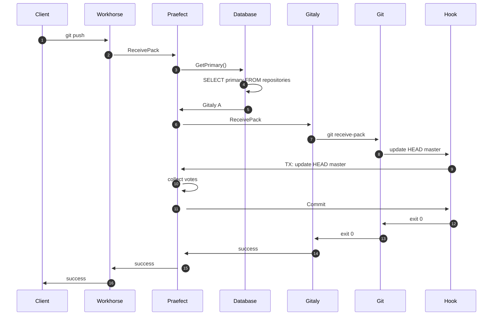

# Gitaly Cluster Failure Mode Analysis

This document attempts to describe the current failure modes of Gitaly
Cluster across versions in an attempt to identify areas of improvements.

## Writes

The following sequence diagram shows what happens during a write in
Gitaly Cluster for GitLab 14.0.x:

In step 3, when Praefect reveives the `ReceivePack` RPC from Workhorse,
it calls `GetPrimary()`, which consults the database. Praefect considers
a primary repository on a per-repository basis, which means that in a
cluster of 3 nodes, the primary repository could reside in any of the 3
nodes. Each entry in the `repositories` table has a row pertaining to a
specific repository, and the `primary` column denotes the current Gitaly
node serving as the primary.

### Failover

In GitLab 14.0.x, failover happens whenever a majority of Praefect nodes
deem that a Gitaly node is no longer a valid primary:

1. The Gitaly node is no longer in the [`valid_primaries` database view](https://gitlab.com/gitlab-org/gitaly/blob/d0083f4c828772537e6891cae4fe0df1f6b255f4/internal/praefect/datastore/migrations/20210525143540_healthy_storages_view.go#L9-20).
1. `valid_primaries` depends on the [`healthy_storages` database view](https://gitlab.com/gitlab-org/gitaly/blob/d0083f4c828772537e6891cae4fe0df1f6b255f4/internal/praefect/datastore/migrations/20210525143540_healthy_storages_view.go#L9-21).
2. `healthy_storages` depends on the [`node_status` datbase table](https://gitlab.com/gitlab-org/gitaly/blob/d0083f4c828772537e6891cae4fe0df1f6b255f4/internal/praefect/datastore/migrations/20210525143540_healthy_storages_view.go#L11).
3. Praefect nodes attempt to send `HealthCheck` RPC messages to Gitaly nodes once per second and update the  [`node_status` table](https://gitlab.com/gitlab-org/gitaly/blob/098c6dcdbde9824385d61b6cc56c2e10724a104b/internal/praefect/nodes/health_manager.go#L144-154) every time.

A failover is triggered whenever a primary node is no longer in the
`valid_primaries` table. This happens when a majority of Praefect nodes:

1. Have updated the `node_status` table to indicate they attempted to
contact the Gitaly node 60 seconds ago.
2. The last successful response from that node was over 10 seconds ago.

In addition, a primary node can also be demoted if the [`replication_queue` for that
node meets certain criteria](https://gitlab.com/gitlab-org/gitaly/blob/371310f8236046666f75710ef02b016011b87deb/internal/praefect/datastore/migrations/20210525173505_valid_primaries_view.go#L22-32).
This can happen if the [Praefect reconciler creates a `delete_replica` job for
that Gitaly node that has not yet been completed](https://gitlab.com/gitlab-org/gitaly/blob/12e0bf3ac80b72bef07a5733a70c270f70771859/internal/praefect/reconciler/reconciler.go#L95-107).

This failover is triggered when a Praefect detects that the
[`healthy_storages` view has changed](https://gitlab.com/gitlab-org/gitaly/blob/098c6dcdbde9824385d61b6cc56c2e10724a104b/internal/praefect/nodes/health_manager.go#L164-189).

For GitLab 14.0.x, when a failover is triggered, Praefect updates **all** repositories
pointing to the original Gitaly node to the new primary. For example,
suppose there are three Gitaly nodes: `gitaly-1`, `gitaly-2`, and
`gitaly-3`. if `gitaly-1` has been marked down, Praefect will attempt to
update the `repositories.primary` column to point to a new primary
chosen randomly. If `gitaly-2` and `gitaly-3` are available, one of them
will randomly be picked.

#### Differences with GitLab 14.1

Starting with GitLab 14.1, Gitaly has been changed to perform the
failover election lazily. That means the failover will NOT affect
**all** repositories pointing to the original node.

### Failure Mode Analysis

Based on the background above, we can summarize possible failures:

| Failure mode       | Generic root cause                        | Specific root causes                      | Likelihood | Effect level |
|--------------------|-------------------------------------------|-------------------------------------------|------------|--------------|
| Writes not working | Workhorse not relaying ReceivePack        | Network outage                            |            |              |
|                    |                                           | DNS failure                               |            |              |
|                    |                                           | Configuration error                       |            |              |
|                    | Incorrect/invalid Praefect database state | Stalled database queries                  |            |              |
|                    |                                           | Database connection limits                |            |              |
|                    |                                           | Out of disk space                         |            |              |
|                    |                                           | Praefect migrations not applied           |            |              |
|                    |                                           | `delete_replica` job incorrectly inserted |            |              |
|                    |                                           | Single node restored from backup          |            |              |
|                    |                                           | Missing/deleted `repositories` entry      |            |              |
|                    | Node status not properly updating         | Praefect deadlock                         |            |              |
|                    |                                           | Gitaly deadlock (Health RPC OK)           |            |              |
|                    |                                           | Database deadlock                         |            |              |
|                    |                                           | Database table/row locks                  |            |              |
|                    |                                           | Inconsistent network partition            |            |              |
|                    |                                           | Clocks out of sync                        |            |              |
|                    |                                           | Configuration error (e.g. auth)           |            |              |
|                    | Repository corruption                     | Hardware reboots/failures                 |            |              |
|                    |                                           | Split-brain due to improper failover      |            |              |
|                    |                                           | Out of disk space                         |            |              |

### Mitigation Strategies (TODO)

1. Since `node_status` is a critical part of failover detection, this should be as robust as possible.
We should [consider a Gossip-based protocol approach](https://gitlab.com/gitlab-org/gitaly/-/issues/3807) to take
the database out of the equation and use a distributed consensus algorithm to obtain a consistent view of the cluster.

1. Check repository checksums with every write.

