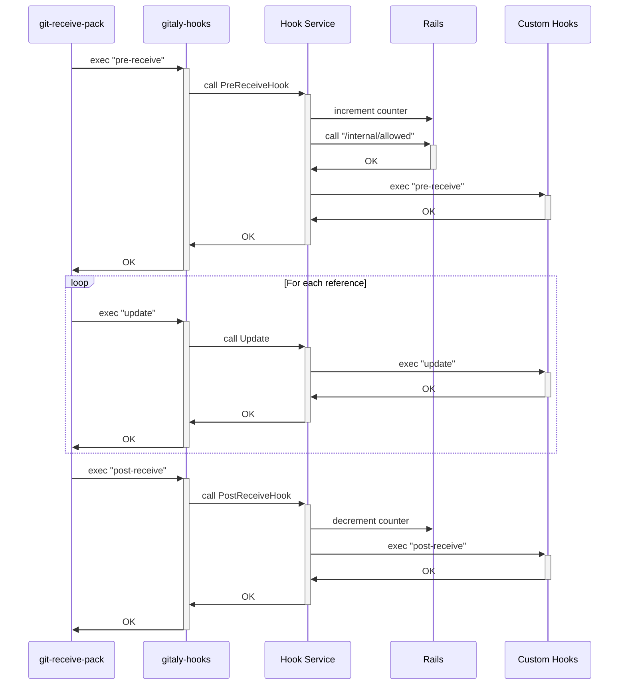
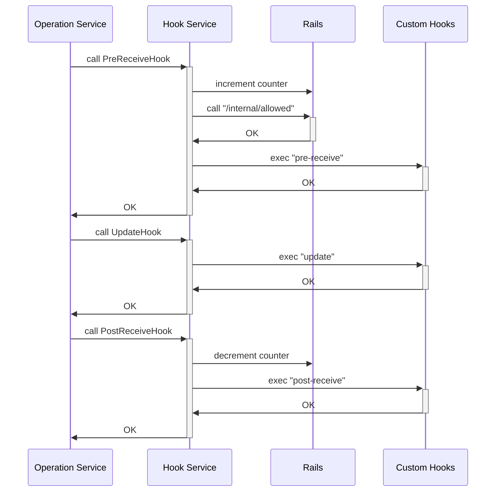

# Gitaly Hooks

Gitaly requires Git to execute hooks after certain mutator RPCs and whenever Git
references are updated. This document explains the different code paths that
trigger hooks.

## Hook Setup

By default, when Git executes hooks, it inspects the `.git/hooks` directory
inside the repository it's executing in. However, Gitaly intercepts this
mechanism. There are no repository-specific hooks we ever want to execute using
this mechanism. Instead, we want to inject our own global hooks that are
required for each repository.

We inject some information into Git commands to set up the hook execution
environment for both Git and ourselves so that the `gitaly-hooks` executable is
able to derive required information:

- We inject `GITALY_BIN_DIR`, which points to Gitaly's binary directory. This is
  used to locate the `gitaly-hooks` binary.
- We inject the `core.hooksPath` config entry, which points to the directory
  containing our global hooks. All hooks are symlinks to the `gitlab-shell-hook`
  script, which locates the `gitaly-hooks` executable using `GITALY_BIN_DIR`.
- We inject `GITALY_HOOKS_PAYLOAD`, which contains JSON-formatted data. This
  payload encodes various information:
    - Which hooks have been requested. Gitaly uses this to only configure a
      subset of hooks even if the executed Git command would run additional
      hooks.
    - Information about the repository the hook is executed in.
    - Information about how to connect to Gitaly.
    - Information about the ongoing transaction, if any.
    - Information about the user who triggered hook. This is required for access
      checks.

The `gitaly-hooks` executable is only a gateway to be able to use gRPC and
execute the hook logic inside of the Gitaly server process. It uses the injected
information to connect to Gitaly and execute the respective RPC call. The
execution path is:

1. Git locates the hook using `core.hooksPath`. If found, this is a symlink
   pointing to the `gitlab-shell-hook` script.
1. The `gitlab-shell-hook` script executes `gitaly-hook`, which it locates using
   `GITALY_BIN_DIR`.
1. `gitaly-hook` connects to Gitaly and executes the corresponding RPC call in
   Gitaly, passing along any hook-specific information to the RPC.
1. Gitaly performs the hook-specific logic in the RPC handler.

## Hook-specific logic

The logic implemented in Gitaly's hook RPC handlers depends on which hook is
being executed.

### Receive-Pack Hooks

These hooks are executed by `git-receive-pack` whenever changes are pushed into
a repository and can be used to:

- Verify whether the changes should be allowed into the repository in the first
  place (`pre-receive` and `update` hooks)
- Show information to the user (`post-update` hook).

While the reference-transaction hook executes on all Gitaly nodes, the
receive-pack style hooks only run on a single Gitaly, which is the primary node.
It can thus happen that receive-pack style hooks reject the update on the
primary node, which is not something the secondary nodes would see. The result
is that secondaries would now hang until the timeout for the RPC call triggers
given that the primary is never going to vote on this transaction. To fix the
hang, transactions support graceful stops: if the primary node fails the RPC
call in code that is only executed on the primary, then it will stop the
transaction and thus tell other Gitaly nodes to stop waiting for quorum.

There are two users of these hooks:

- `PostReceivePack` and `SSHReceivePack` directly invoke `git-receive-pack`,
  which then executes the hooks for us.
- Most RPCs in the OperationService that write objects into the repository
  manually invoke these hooks using the `updateref.UpdaterWithHooks` structure.

These hooks perform the following functions:

- `pre-receive`: The pre-receive hook receives all reference updates as a whole
  via standard input, where each change is represented by one line with the old
  and new object ID as well the name of the reference that is to be updated. At
  this point, all objects required to satisfy the update have already been
  received, but they are still in a separate "quarantine directory" and are
  therefore detached from the main repository. This hook first increments a
  reference counter that tracks how many pushes are active at the same time.
  Afterwards, it posts all changes to Rails' `/internal/allowed` API endpoint so
  that Rails can determine whether the change is allowed or not. Because objects
  still live in a quarantine directory, Gitaly tells Rails where it can find the
  quarantine directory using the repository's alternative object directory
  fields so that any subsequent RPC calls that check the change can access those
  objects. When the access checks succeed, any existing custom pre-receive hooks
  installed by the admin are executed.
- `update`: The update hook runs after the pre-receive hook at the point where
  objects from the object quarantine directory have already been migrated into
  the main repository. This hook only executes custom hooks installed by the
  admin.
- `post-receive`: This hook prints information to the user (for example, the
  merge request link). It also decrements the reference counter incremented in
  the pre-receive hook.

Note: The reference is per repository so GitLab knows when a certain repository
can be moved. If the reference counter is not at 0, there are active pushes
happening.

#### Error Messages

Both custom hooks and the `/internal/allowed` API endpoint may return
specially-formatted error messages that have either a `GitLab:` or a
`GL-Hook-Error:` prefix. Messages with this prefix are returned as-is to Rails
and signify an error message that ought to be printed to the user directly,
either through the user interface or through standard error of
`git-receive-pack`.

#### Custom Hooks

Administrators can install custom hooks that run after the usual logic executed
by Gitaly itself. Custom hooks are _never_ expected to replace Gitaly's own
hooks, which are mandatory. Gitaly supports installation of custom hooks for the
`pre-receive`, `update`, and `post-receive` hooks. See the [GitLab server hooks
documentation](https://docs.gitlab.com/ee/administration/server_hooks.html).

## Execution Path

The following sequence diagram depicts the order in which hooks are executed for
`git-receive-pack`-based RPCs:

The following sequence diagram depicts the order in which hooks are executed for
RPCs in the `OperationService`:

