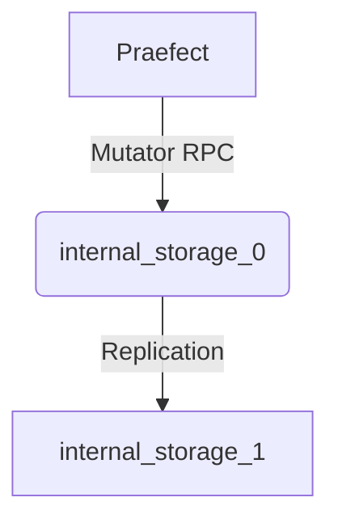
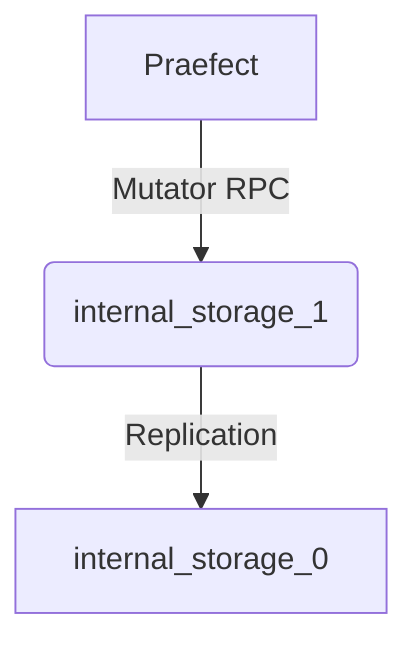

# Running Praefect

This document describes how to run praefect.

## Failover

There are two ways to do a failover from one internal gitaly node to another as the primary. Manually, or automatically.

As an example, in this config.toml we have 1 virtual storage named "default" with 2 internal gitaly nodes behind it.
One is deemed the "primary". This means that read and write traffic will go to `internal_storage_0`, and writes
will get replicated to `internal_storage_1`.

```toml
socket_path = "/path/to/praefect.socket"

# failover_enabled will enable automatic failover
failover_enabled = false

[logging]
format = "json"
level = "info"

[[virtual_storage]]
name = "default"

[[virtual_storage.node]]
  name = "internal_storage_0"
  address = "tcp://localhost:9999"
  primary = true
  token = "supersecret"

[[virtual_storage.node]]
  name = "internal_storage_1"
  address = "tcp://localhost:9998"
  token = "supersecret"
```

### Manual Failover

In order to failover from using one internal gitaly node to using another, a manual failover step can be used. Unless `failover_enabled` is set to `true`
in the config.toml, the only way to fail over from one primary to using another node as the primary is to do a manual failover.


1. Edit config.toml by moving `primary = true` from the current `[[virtual_storage.node]]`, to another one:
```toml
[[virtual_storage.node]]
  name = "internal_storage_0"
  address = "tcp://localhost:9999"
  # no longer the primary
  token = "supersecret"

[[virtual_storage.node]]
  name = "internal_storage_1"
  address = "tcp://localhost:9998"
  # this is the new primary
  primary = true
  token = "supersecret"
```

1. On a restart, praefect will send write traffic to `internal_storage_1`. `internal_storage_0` is the new secondary now,
and replication jobs will be created to replicate repository data to `internal_storage_0` **from** `internal_storage_1`

## Automatic Failover

When `failover_enabled` is set to true in the config.toml, Praefect will do automatic detection of the health of
internal gitaly nodes. If the primary has a certain amount of healthchecks fail, it will decide to promote one of the
secondaries to be primary, and demote the primary to be a secondary.

```toml
# failover_enabled turns on automatic failover
failover_enabled = true

[[virtual_storage.node]]
  name = "internal_storage_0"
  address = "tcp://localhost:9999"
  primary = true
  token = "supersecret"

[[virtual_storage.node]]
  name = "internal_storage_1"
  address = "tcp://localhost:9998"
  token = "supersecret"
```

Below is the picture when praefect starts up with the config.toml above:



Let's say suddenly `internal_storage_0` goes down. Praefect will detect this and
automatically switch over to `internal_storage_1`, and `internal_storage_0` will serve as a secondary:



NOTE: Currently this feature is supported for setups that only have 1 praefect. If there are 2 or more
praefect instances running, for instance behind a load balancer, `failover_enabled` should be disabled. The reason is
because there is no coordination that currently happens across different praefect instances, so there could be a situation
where two praefects think two different gitaly nodes are the primary.

