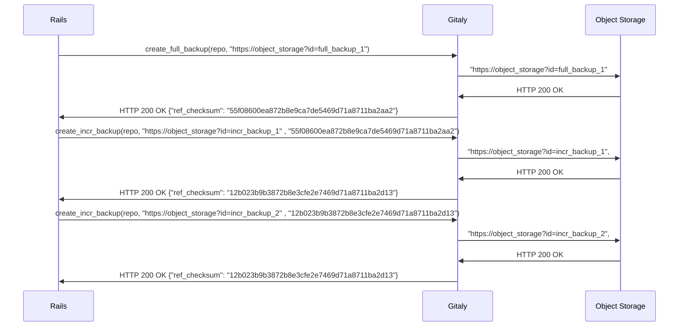
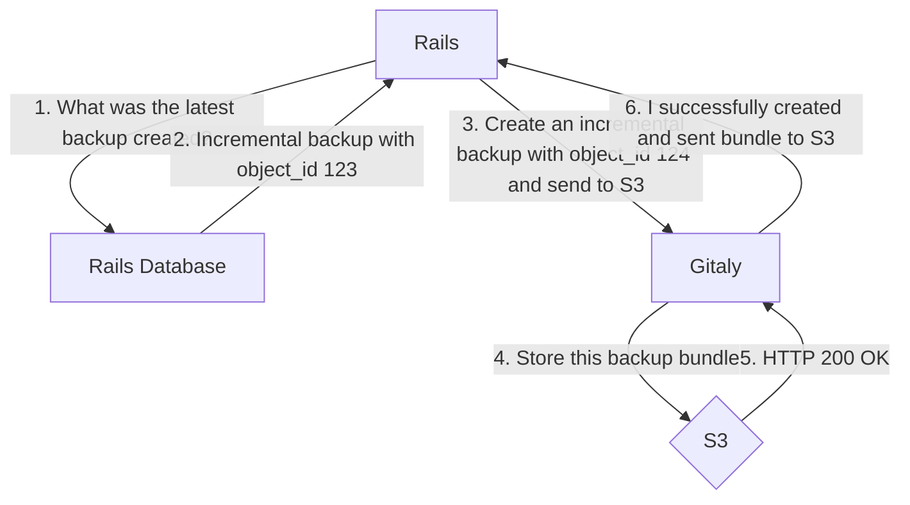
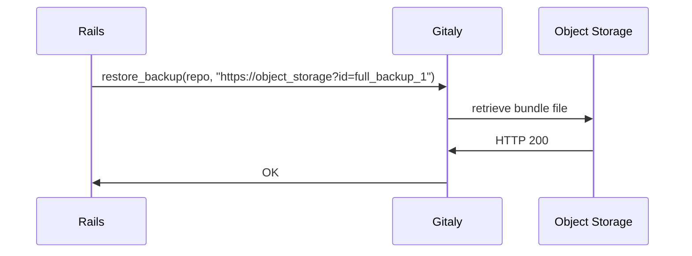
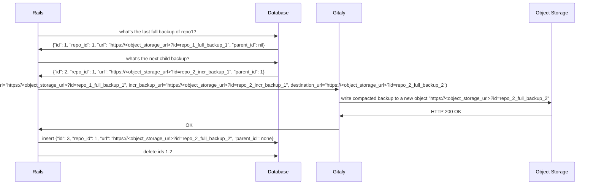

# Incremental Backups

## Goal

Save time and money with automated incremental backups where a system admin can configure their GitLab
instance to make backups on a schedule, where each backup operation is an incremental backup. A restore would
be applying each incremental backup on top of each other.

## Design

### Making Backups

1. In this diagram, Rails first calls Gitaly to make a full backup. This will generate a full [Gitaly Bundle file](snapshot-storage.md).

2. Gitaly will send this file off to the object storage via a signed url. Once it gets a 200 OK, Gitaly will write the refs part of the
Gitaly Bundle file to a a file in the `.gitaly_bundle` directory in the repository directory with the checksum of the contents as the filename.

2. This file will be used to generate incremental backups. Gitaly will then take the checksum of
this refs snapshot and send it back to Rails. Rails will save this checksum in the database.

3. Next, Rails makes a request to Gitaly to generate an incremental snapshot. This time it provides the latest refs snapshot checksum it has.

4. When Gitaly receives this request, it looks in its `path/to/repo.git/.gitaly_bundle` for the refs snapshot. If it exists, then we know that
we can safely generate an incremental backup and send it to object storage. If it doesn't, then that means we can't and we fail the request. In
this failure mode, Rails would ask Gitaly to generate a full backup.

### Database Schema

We will store a record of the backups in the Rails Database while the actual bundle files will be shipped to
object storage. That way, we will have a linked list of incremental backups. This will also allow us to do compaction.

### Restoring from Backups

To restore a repository from backups, Rails will send repeated requests with signed requests containing the next incremental backup.
These will get applied to the repository using the method described in [Gitaly Bundle file](snapshot-storage.md).

### Compaction
Incremental backups will begin to pile up. Restoring from many backups can be slow and expensive. We can optimize this process
by compacting the incremental backups into self-contained backups every once in a while.

An occassional compaction job (let's say it's nightly) would compact incremental backups into a full backup.

### In the event of database corruption

If we use the following bucket and object id scheme, then it would still be possible to recover repositories even if there is corruption in the database.

![Bucket Naming Scheme]
(img/backup_buckets.png)

![Object Naming Scheme]
(img/backups_incr_objects.png)

Each repository has two buckets, one for full backups and one for incremental. The incremental backups are also named with a monotimically increasing
id along with the full backup id they were created from.  This way, we can develop a gitaly command that can still do compaction as well as repository
restoration.

