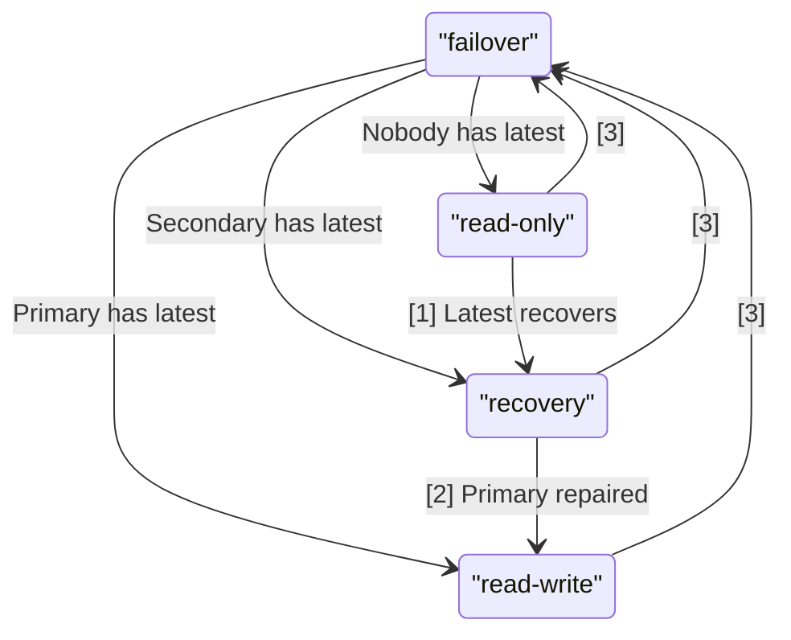

# RFC: Praefect Dataloss and Recovery Strategy

## Abstract

This RFC proposes a strategy for Praefect to prevent, detect, and recover from dataloss.

## Dataloss Prevention

To reduce additional dataloss and conflicts, Praefect may keep repositories in read-only mode when a primary-failover occurs that results in potential dataloss.
By putting a repository in read-only mode, it prevents the unavailable data on the previous primary from diverging from new writes on the remaining replicas.
Diverging replicas of a repository can lead to split-brain situations which may require manual intervention to repair, so they should be avoided when possible.

A primary-failover happens when a primary node is no longer considered healthy by a Praefect cluster.
The Praefect cluster will then designate a new Primary from one of the remaining nodes in order to continue serving requests.

Once a new primary has been designated, a repository is in one of the following possible states:

- **Read-Write**
  - Happens when the new primary replica has the latest changes
  - Praefect will schedule new replications from the primary to any replicas missing the latest changes
  - Praefect will continue to process both mutator and accessor RPCs for the repository
- **Recovery**
  - Happens when the new primary replica is missing the latest changes but the latest changes exist on another available replica
  - Praefect will only process accessor RPCs until the primary receives the latest changes
  - Praefect will attempt to propagate changes from repos with the latest changes to the repos missing them
  - Once the primary is repaired, Praefect will start processing mutator RPCs again. This will put the repository into read-write state.
- **Read-only**
  - Happens when none of the remaining replicas have the latest changes
  - Praefect will only process accessor RPCs
  - Read-only state can be overridden manually by an administrator via forgiveness process
  - Read-only state can be resolved when a node containing the latest changes becomes healthy again. This will put the repository into the recovery state.

### Repository State Summary

| State      | Primary has latest | Secondaries have latest | RPCs Processed     |
| ---------- | ------------------ | ----------------------- | ------------------ |
| Read-Write | Yes                | Irrelevant              | Accessor + Mutator |
| Recovery   | No                 | Yes, at least one does  | Accessor           |
| Read-Only  | No                 | No, none of them do     | Accessor           |

### Repository State Diagram



- [1] **Recovery or Forgiveness** - occurs when the missing latest changes for repository become available again or an admin decides to forgive the dataloss
- [2] **Primary Repaired** - when the primary replica of a repository is repaired by receiving latest changes from a secondary. Once repair is complete, a repository will be in read-write mode
- [3] - Any any state, the primary may failover

## Replication Log

Praefect is capable of detecting dataloss resulting from incomplete replication jobs in the replication log.[^1]
The replication log is a database persisted log data structure of all open and closed replication jobs in sequential order.
Open jobs are jobs that have not yet been completed or cancelled.
Closed jobs are jobs that Praefect no longer needs to process.
When processing replication jobs, a Praefect instance will process each unique[^2] open job in sequential order.
A Praefect cluster will not process more than one job at a time per repository replica.
The job will be attempted indefinitely until completed successfully or cancelled (via forgiveness or repair).

```
┏━━━Replication Log━━━┓                                        
┃                     ┃                                        
┃ ┌ ─ Closed Jobs ─ ┐ ┃                                        
┃   ┌─────────────┐   ┃                                        
┃ │ │    J[0]     │ │ ┃                                        
┃   ├─────────────┤   ┃                                        
┃ │ │     ...     │ │ ┃                                        
┃   ├─────────────┤   ┃                                        
┃ │ │    J[m]     │ │ ┃                                        
┃   └─────────────┘   ┃                                        
┃ ├ ─ ─Open Jobs─ ─ ┤ ┃                                        
┃   ┌─────────────┐   ┃                                        
┃ │ │   J[m+1]    │◀┼─╋─── Oldest open job processed first     
┃   ├─────────────┤   ┃                                        
┃ │ │     ...     │ │ ┃                                        
┃   ├─────────────┤   ┃                                        
┃ │ │   J[m+n]    │◀┼─╋─── New jobs inserted at end of queue   
┃   └─────────────┘   ┃                                        
┃ └ ─ ─ ─ ─ ─ ─ ─ ─ ┘ ┃                                        
┗━━━━━━━━━━━━━━━━━━━━━┛                                        
```

Each secondary replica of a repository is considered to have the latest changes when the last replication job for that replica is completed successfully.

When a repository is in read-only mode and a node containing the latest changes becomes available (i.e. healthy), this will signal to Praefect that the primary should be repaired.

### Recovery from Primary Node

Given 3 replicas of a repository (Primary X, Secondary Y, and Secondary Z), consider the following replication logs after the primary is mutated:

| Replica X (Primary) | Replica Y                            | Replica Z                            |
| ---------------- | ------------------------------------ | ------------------------------------ |
| `-- start open jobs--` | `-- start open jobs--`               | `-- start open jobs--`               |
|                  | `ID=1, Src=X, Dst=Y, State=Incomplete` | `ID=1, Src=X, Dst=Z, State=Incomplete` |

Then, Primary X becomes unavailable before the open jobs have a chance to complete. Praefect chooses a new primary (Y). The repo will now be in read-only mode.

If replica X becomes available again, this will trigger Praefect to reattempt the original jobs:

| Replica X | Replica Y (Primary) | Replica Z |
| ---------------- | ------------------------------------ | ------------------------------------ |
| `-- start open jobs--` | `-- start open jobs--`               | `-- start open jobs--`               |
|                  | `ID=1, Src=X, Dst=Y, State=Complete` | `ID=1, Src=X, Dst=Z, State=Complete` |

Now the repository is in read-write mode.

### Recovery from Secondary Node

Given 3 replicas of a repository (Primary X, Secondary Y, and Secondary Z), consider the following replication logs after the primary is mutated:

| Replica X (Primary) | Replica Y | Replica Z                            |
| ---------------- | ---------------- | ------------------- |
| `-- start closed jobs--` | `-- start closed jobs--` | `-- start closed jobs--` |
| | |  `ID=1, Src=X, Dst=Z, State=Complete` |
| `-- start open jobs--` | `-- start open jobs--` | `-- start open jobs--` |
| | `ID=1, Src=X, Dst=Y, State=Incomplete` | |

Replica Z finishes all open replication jobs. Then, Primary X and Y become unavailable before Replica Y completes. Praefect chooses a new primary (Y). The repo will now be in read-only mode:

| Replica X (OFFLINE) | Replica Y (Primary) | Replica Z (OFFLINE) |
| ---------------- | ---------------- | ------------------- |
| `-- start closed jobs--` | `-- start closed jobs--` | `-- start closed jobs--` |
| | |  `ID=1, Src=X, Dst=Z, State=Complete` |
| `-- start open jobs--` | `-- start open jobs--` | `-- start open jobs--` |
| | `ID=1, Src=X, Dst=Y, State=Incomplete` | |

Then, Z becomes available again. This puts the repository into recovery mode. This will trigger Praefect to cancel the previous replication job for Y and schedule a new one to propagate from Z to Y:

| Replica X (OFFLINE) | Replica Y (Primary) | Replica Z |
| ---------------- | ---------------- | ------------------- |
| `-- start closed jobs--` | `-- start closed jobs--` | `-- start closed jobs--` |
| | `ID=1, Src=X, Dst=Y, State=Cancelled` | `ID=1, Src=X, Dst=Z, State=Complete` |
| `-- start open jobs--` | `-- start open jobs--` | `-- start open jobs--` |
| | `ID=2, Src=Z, Dst=Y, State=Incomplete` | |

Once Y completes all open jobs, it will become a read-write repository again:

| Replica X (OFFLINE) | Replica Y (Primary) | Replica Z |
| ---------------- | ---------------- | ------------------- |
| `-- start closed jobs--` | `-- start closed jobs--` | `-- start closed jobs--` |
| | `ID=1, Src=X, Dst=Y, State=Cancelled` | `ID=1, Src=X, Dst=Z, State=Complete` |
| | `ID=2, Src=Z, Dst=Y, State=Complete` | |
| `-- start open jobs--` | `-- start open jobs--` | `-- start open jobs--` |

## Dataloss Forgiveness

When the only replicas containing the latest changes for a repository are no longer viable, a GitLab administrator may wish to "forgive" the dataloss.

[^1]: This proposal intentionally leaves out dataloss resulting from disk corruption or other physical defects during data transfer and storage that are not detected by Gitaly.

[^2]: Praefect will intelligently collapse jobs of a similar type to reduce the number of replication jobs processed once https://gitlab.com/gitlab-org/gitaly/-/issues/2438 is closed. As part of that issue, Praefect will work on the newest job first, and once successful mark all older contiguous jobs of the same kind with the same status.
