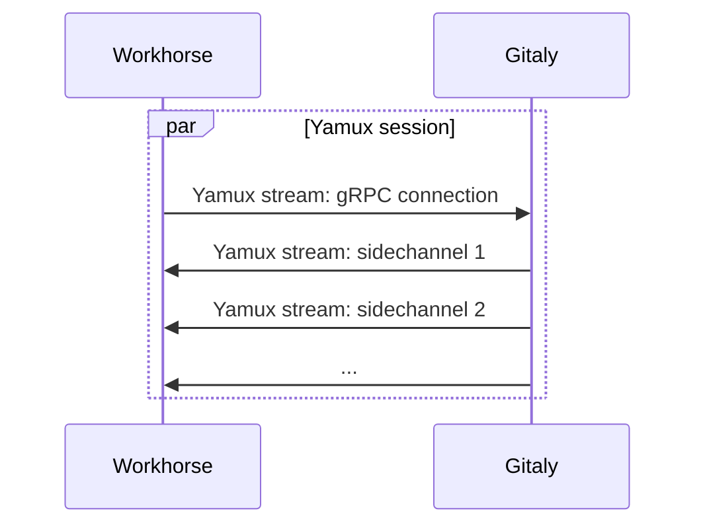

# Gitaly sidechannels

Since GitLab 14.4, Gitaly supports a custom protocol for RPCs that
transfer a high volume of byte stream data. Currently, this only
applies to `PostUploadPackWithSidechannel`, which is used for Git HTTP
traffic.

Prior to sidechannel, the only way for Gitaly to serve a byte stream
was to encapsulate the bytes in gRPC Protobuf messages. Because of the
per-message overhead, this acted as a limiting factor on how much Git
fetch traffic a Gitaly server could serve up.

The sidechannel protocol works around this by:

1. Allowing the Gitaly server to establish a sidechannel to the Gitaly client during an RPC call.
1. Performing the bulk data transfer on the sidechannel.

The surrounding gRPC call is then only used for:

- Parameters such as which repository we're reading data from.
- Control information such as the status code and possible error value returned by the server.

To make this possible without needing extra network ports we use a
connection multiplexing library called
[Yamux](https://github.com/hashicorp/yamux). Yamux enables us to
establish multiple virtual network connections (Yamux "streams")
within a single real network connection (a Yamux "session"). The
Gitaly client establishes one (persistent) Yamux stream to make gRPC
calls on. Everytime a sidechannel is needed, the Gitaly server will
establish a short-lived Yamux stream in the opposite direction.

Because the connection between Workhorse and Gitaly is now a Yamux
connection instead of a gRPC connection, you can't
route Workhorse->Gitaly traffic through a gRPC proxy. If you need a
proxy between Workhorse and Gitaly, use a TCP proxy instead.

For more information about how and why we introduced sidechannels, see
https://gitlab.com/groups/gitlab-com/gl-infra/-/epics/463.

## Implementation details

Sidechannels piggy-back on the existing mechanism of `backchannel`
connections that Praefect uses when connecting to one of its backend
Gitaly nodes. Backchannel uses gRPC-Go "transport credentials" to
intercept and replace outgoing (client) and incoming (server) gRPC
connections. Backchannel only needs 2 Yamux streams:

- Client->server.
- Server->client.

However, as a side effect it creates a Yamux session. Sidechannel uses
the Yamux session already created by backchannel to establish the
short-lived Yamux streams it needs.
